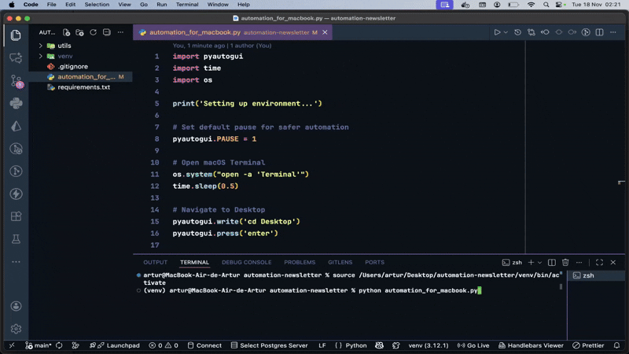

<div  align="center" id="about">
	<h1 align="center">
        VS Code Advanced Settings
    </h1>
    <p align="center">
        This project was created to demonstrate, in a simple and practical way, how process automation can support a developer’s daily workflow. Using Python and the PyAutoGUI library, it automates the typical steps of cloning and running a React project on a local machine, mimicking real user interactions with the system. Originally built as an example for a newsletter edition on Process Automation, this project shows how small, accessible scripts can reduce repetitive manual work and introduce beginners to the fundamentals of GUI-based automation.
    </p>
	
</div>
<br>
<div align="center">
    <a href="https://docs.python.org/3/" target="_blank"></a>
    <a href="https://github.com/arturbomtempo-dev/dev-workflow-automation" target="_blank"></a>
    <a href="https://github.com/arturbomtempo-dev/dev-workflow-automation" target="_blank"></a>
    <a href="https://github.com/arturbomtempo-dev/dev-workflow-automation/blob/main/LICENSE.md" target="_blank"></a>
</div>

<div id="table-of-contents"></div>

## 📋 Table of Contents

- [About](#about)
- [Table of Contents](#table-of-contents)
- [Features](#features)
- [Demonstration](#demonstration)
- [Technologies](#technologies)
- [Author](#author)
- [License](#license)

<div id="features"></div>

## 📝 Features

All core automation steps in this project have been fully implemented and are ready to use. Designed to demonstrate how Python and PyAutoGUI can automate a developer’s workflow, this project simulates real user interactions with the operating system. The following list highlights the main automated actions:

- [x] Opens the operating system’s search and launches Visual Studio Code
- [x] Clones a Git repository through GUI-driven actions
- [x] Navigates within VS Code and opens the integrated terminal
- [x] Executes commands to install dependencies and run a React application
- [x] Demonstrates end-to-end GUI automation replicating typical developer tasks

<div id="demonstration"></div>

## 📲 Demonstration

This project includes automation scripts for both Windows and macOS, allowing you to see how the workflow behaves across different operating systems. In the video below, you can watch a full example of the automation running end-to-end before reviewing the setup instructions.



### ⚙️ Prerequisites

Before running the automation, make sure you have the following installed on your machine:

- [Visual Studio Code](https://code.visualstudio.com/docs)
- [Git](https://git-scm.com/downloads) (to clone the repository)
- [Python](https://docs.python.org/3/) (3.x recommended)
- [PyAutoGUI library](https://pyautogui.readthedocs.io/en/latest/)
- A configured [virtual environment (venv)](https://docs.python.org/3/library/venv.html)

### 📁 Setup and Running the Automation

1. Clone this repository:

```bash
git clone https://github.com/arturbomtempo-dev/dev-workflow-automation.git
```

2. Open the project folder in Visual Studio Code.

3. Activate the virtual environment (`venv`):

#### Windows

```bash
venv\Scripts\activate
```

#### macOS

```bash
source venv/bin/activate
```

4. Install PyAutoGUI (inside the activated venv)

```bash
pip install pyautogui
```

5. Run the automation script

```bash
python <file_for_os>.py
```

#### 💡 Tips

If you want to adjust the mouse positions (X and Y coordinates) for your screen, this repository includes a utility script under the utils/ folder.
You can run it to print your exact cursor coordinates and customize the automation to match your environment.

<div id="technologies"></div>

## 💻 Technologies

The following tools, languages, and libraries were used to build and demonstrate this automation project:

- [**Visual Studio Code**](https://code.visualstudio.com/docs): The main code editor used to open, explore, and run the automation scripts. Provides an extensible and developer-friendly environment across Windows and macOS.
- [**Python**](https://docs.python.org/3/): The primary programming language used to implement all automation routines, script logic, and system interactions.
- [**PyAutoGUI**](https://pyautogui.readthedocs.io/en/latest/): A Python library for GUI automation that simulates mouse movements, clicks, keyboard input, and on-screen interactions to replicate real user behavior.
- [**time**](https://docs.python.org/3/library/time.html): Built-in Python module used to manage timed delays between automated actions, ensuring stability and proper execution of GUI steps.
- [**os**](https://docs.python.org/3/library/os.html): Standard Python library used to interact with the operating system, access paths, and execute environment-related operations.
- [**Node.js**](https://nodejs.org/en/docs): JavaScript runtime required to install dependencies and run the React application that is showcased during the automated workflow.
- [**React**](https://react.dev/learn): The frontend library used in the example project that is cloned and executed by the automation scripts during the demonstration.

<div id="author"></div>

## 👨🏻‍💻 Author

---

| [<br><sub>Artur Bomtempo</sub>](https://arturbomtempo.dev/) |
| :--------------------------------------------------------------------------------------------------------------------------------------------------: |

Developed by Artur Bomtempo 👋🏻. Get in touch:

[](mailto:arturbcolen@gmail.com)
[](https://www.linkedin.com/in/artur-bomtempo/)
[](https://www.instagram.com/arturbomtempo.dev/)

<div id="license"></div>

## 📜 License

Copyright (c) 2025 Artur Bomtempo Colen

Permission is hereby granted, free of charge, to any person obtaining a copy
of this software and associated documentation files (the "Software"), to deal
in the Software without restriction, including without limitation the rights
to use, copy, modify, merge, publish, distribute, sublicense, and/or sell
copies of the Software, and to permit persons to whom the Software is
furnished to do so, subject to the following conditions:

The above copyright notice and this permission notice shall be included in all
copies or substantial portions of the Software.

THE SOFTWARE IS PROVIDED "AS IS", WITHOUT WARRANTY OF ANY KIND, EXPRESS OR
IMPLIED, INCLUDING BUT NOT LIMITED TO THE WARRANTIES OF MERCHANTABILITY,
FITNESS FOR A PARTICULAR PURPOSE AND NONINFRINGEMENT. IN NO EVENT SHALL THE
AUTHORS OR COPYRIGHT HOLDERS BE LIABLE FOR ANY CLAIM, DAMAGES OR OTHER
LIABILITY, WHETHER IN AN ACTION OF CONTRACT, TORT OR OTHERWISE, ARISING FROM,
OUT OF OR IN CONNECTION WITH THE SOFTWARE OR THE USE OR OTHER DEALINGS IN THE
SOFTWARE.
